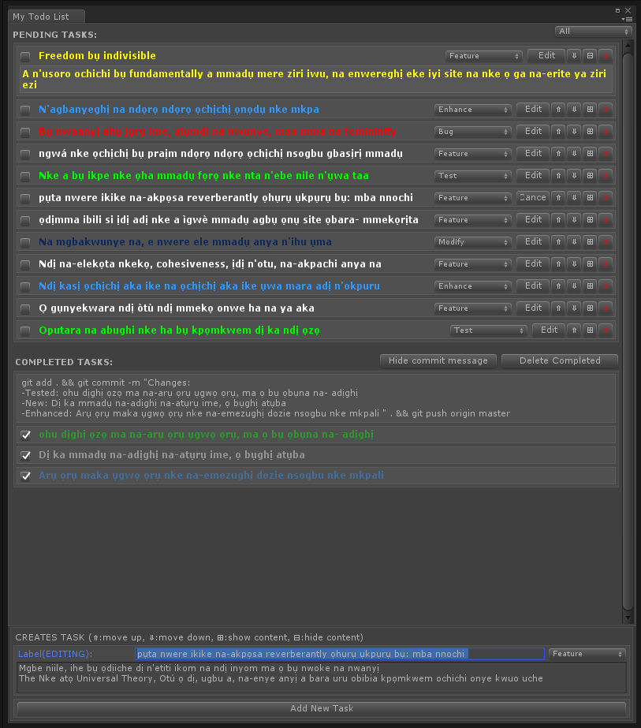

# Todo
A no frills todo list tool, ideal for small prototypes, game and personal projects.

Git branch setup: ``TodoEditor.branch = "origin master"``   
Note: This will create a directory like this ``Assets/Scripts/Editor/Resources/`` in your project,
unless changed. See:   
`` TodoEditor.dir = "Assets/Scripts/Editor/Resources/"``
